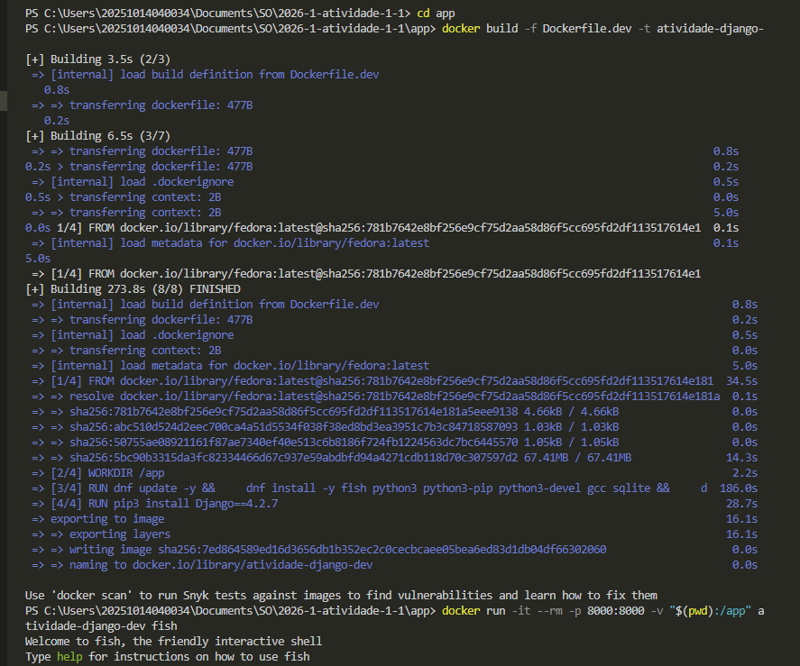
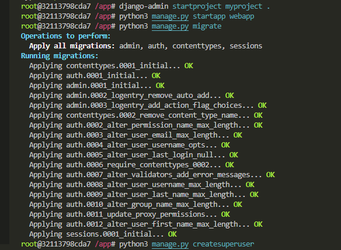
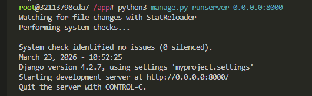
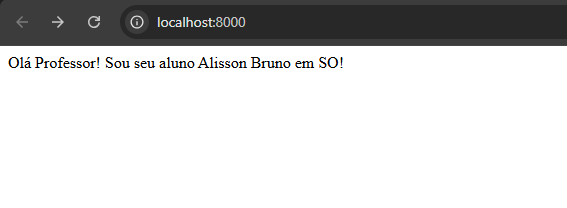
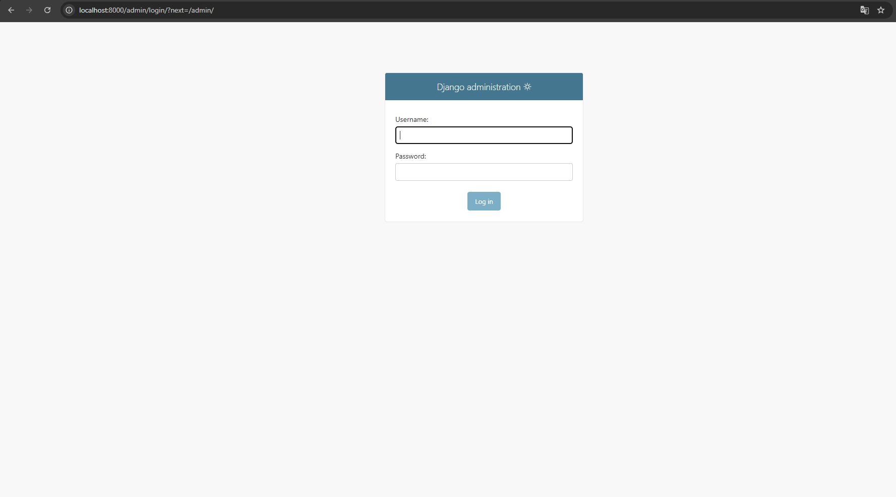
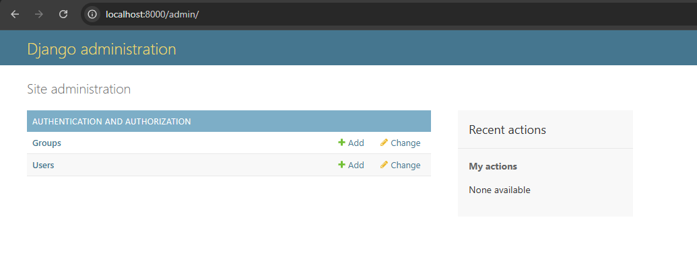

# Alisson Bruno Dantas Felix

## Introdução

Essa atividade tem um passo a passo de instalação e configuração de uma aplicação web com o framework `Django` em um ambiente conteinerizado com o `Docker`. A imagem base foi o `Fedora`, na sua última versão (43).

Além disso, foi mapeada as pastas e portas entre o sistema hospedeiro e o conteiner.

## Relato das atividades

### Parte 1. Preparação do projeto

Fiz o fork da atividade, clonei o repositório na pasta Documents\SO e criei a pasta `app`, onde será compartilhada os entre o host e conteiner.

```bash
git clone https://github.com/alibruno/2026-1-atividade-1-1.git
```

### Parte 2. Criar a imagem Docker e executar o conteiner

Construção da imagem e conteiner: 



### Parte 3: Criar e configurar a aplicação Django

Após o 2º comando, fiz as seguintes modificações:

- O Django já vem configurado para usar SQLite3 por padrão. Verifiquei o arquivo `myproject/settings.py`:

- Editei o arquivo `myproject/settings.py` e adicionei 'webapp' em `INSTALLED_APPS`:

- No arquivo `myproject/settings.py`, configurei o ALLOWED_HOSTS para aceitar todas as conexões: `ALLOWED_HOSTS = ['*']`



Por fim, executei os comandos restantes. Vale resaltar que o último precisa definir o `Username`, `Email` (Opcional), `Password` e `Password (again)`. Se a senha for muito curta, digite y para confirmar.

Criei uma view simples e configurei as rotas (url)

### Parte 4. Executar e acessar a aplicação Django

Subi a aplicação:




Entrei no home:



Entrei no admin:

Parte 1: 


Parte 2: 


## Considerações finais

Aprendi a criar uma aplicação django em conteiner e como acessá-la remotamente.